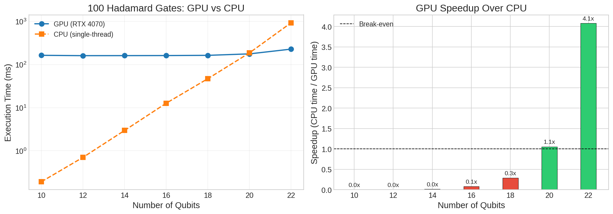
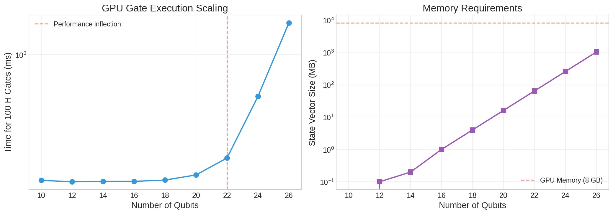
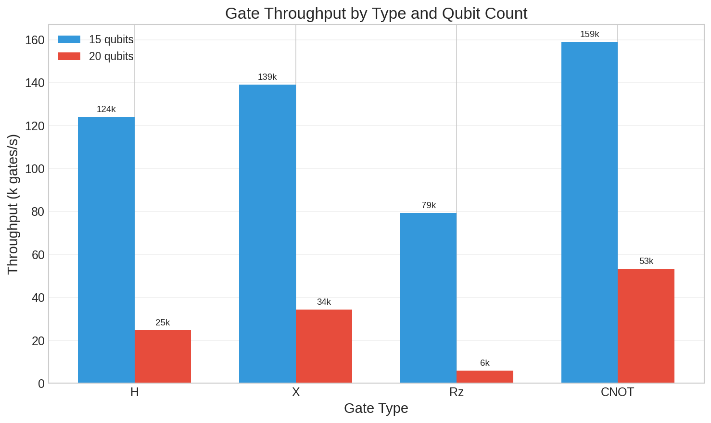

# CUDA Quantum Simulator

A high-performance quantum state vector simulator implemented in CUDA C++. This project demonstrates GPU-accelerated quantum computing simulation, targeting research-grade code quality suitable for PhD program portfolios.

## Features

- **GPU-Accelerated Simulation**: Full state vector simulation on NVIDIA GPUs
- **Standard Gate Set**: X, Y, Z, H, S, T, S†, T†, Rx, Ry, Rz, CNOT, CZ, SWAP, Toffoli (CCX), CRY, CRZ
- **Noise Models**: Depolarizing, amplitude damping (T1), phase damping (T2), bit flip, phase flip
- **Density Matrix Simulation**: Exact mixed state simulation via Kraus operators (1-14 qubits)
- **Batched Simulation**: Run multiple trajectories in parallel for Monte Carlo sampling
- **Optimized Kernels**: Shared memory tiling and coalesced access patterns with auto-dispatch
- **Measurement**: Single-qubit measurement with state collapse and multi-shot sampling
- **Fluent Circuit API**: Chainable gate operations with input validation
- **RAII Memory Management**: Safe GPU memory handling with automatic cleanup
- **Validated Implementation**: GPU results verified against CPU reference; gate definitions follow Qiskit/Cirq conventions
- **Comprehensive Test Suite**: Unit tests using Google Test framework

## Benchmark Results

Tested on NVIDIA RTX 4070 Laptop GPU (8GB VRAM, Compute Capability 8.9)

### GPU vs CPU Performance



The GPU simulator becomes faster than single-threaded CPU at **20 qubits**, achieving:
- **1.1x speedup** at 20 qubits (1M states)
- **4.1x speedup** at 22 qubits (4M states)

### Scaling Characteristics



| Qubits | States | Memory | 100 H Gates |
|--------|--------|--------|-------------|
| 20 | 1M | 16 MB | 148 ms |
| 22 | 4M | 64 MB | 194 ms |
| 24 | 16M | 256 MB | 516 ms |
| 26 | 67M | 1 GB | 1.66 s |

### Gate Throughput (20 qubits)



| Gate | Throughput |
|------|------------|
| CNOT | 53,200 gates/s |
| X | 34,300 gates/s |
| H | 24,600 gates/s |
| Rz | 5,940 gates/s |

## Requirements

- **CUDA Toolkit** 12.0 or later
- **CMake** 3.18 or later
- **C++17** compatible compiler
- **NVIDIA GPU** with Compute Capability 7.0+ (tested on RTX 4070)

## Building

```bash
# Clone and build
cd cuda-quantum-simulator
mkdir build && cd build
cmake .. -DCMAKE_BUILD_TYPE=Release
make -j$(nproc)

# Run tests
ctest --output-on-failure

# Run demo
./quantum_sim

# Run benchmarks
./benchmark_gates
./benchmark_scaling
```

## Usage

### Basic Circuit Execution

```cpp
#include "Simulator.hpp"
using namespace qsim;

// Create a 2-qubit Bell state
Simulator sim(2);
Circuit circuit(2);
circuit.h(0).cnot(0, 1);  // |Φ+⟩ = (|00⟩ + |11⟩)/√2

sim.run(circuit);
auto probs = sim.getProbabilities();
// probs[0] ≈ 0.5, probs[3] ≈ 0.5
```

### Measurement and Sampling

```cpp
// Sample from the probability distribution (non-destructive)
auto samples = sim.sample(1000);

// Measure a single qubit (collapses state)
int result = sim.measureQubit(0);
```

### Factory Circuits

```cpp
// Pre-built circuits for common states
auto bell = Circuit::createBellCircuit();
auto ghz = Circuit::createGHZCircuit(5);
auto random = Circuit::createRandomCircuit(4, 20);  // 4 qubits, depth 20
```

### Noisy Simulation

```cpp
#include "NoiseModel.cuh"
using namespace qsim;

// Create a noise model with depolarizing error
NoiseModel noise;
noise.addDepolarizing(0.01);  // 1% depolarizing probability per gate

// Run noisy simulation (Monte Carlo wavefunction method)
NoisySimulator sim(3, noise, /*seed=*/42);
Circuit circuit(3);
circuit.h(0).cnot(0, 1).cnot(1, 2);

sim.run(circuit);
auto probs = sim.getProbabilities();
```

### Batched Monte Carlo Sampling

```cpp
// Run 1000 noisy trajectories in parallel on GPU
NoiseModel noise;
noise.addDepolarizing(0.005);
noise.addAmplitudeDamping(0.001);  // T1 decay

BatchedSimulator batch(/*n_qubits=*/3, /*batch_size=*/1000, noise);
Circuit circuit(3);
circuit.h(0).cnot(0, 1).cnot(1, 2);

batch.run(circuit);

// Get average probabilities across all trajectories
auto avg_probs = batch.getAverageProbabilities();

// Get histogram of measurement outcomes
auto histogram = batch.getHistogram();  // Counts for each basis state
```

### Available Noise Channels

| Noise Type | Description | Usage |
|------------|-------------|-------|
| Depolarizing | Random Pauli error (X, Y, or Z with equal probability) | `noise.addDepolarizing(p)` |
| Amplitude Damping | T1 decay - relaxation to ground state | `noise.addAmplitudeDamping(gamma)` |
| Phase Damping | T2 dephasing - loss of phase coherence | `noise.addPhaseDamping(gamma)` |
| Bit Flip | X error with probability p | `noise.addBitFlip(p)` |
| Phase Flip | Z error with probability p | `noise.addPhaseFlip(p)` |
| Bit-Phase Flip | Y error with probability p | `noise.addBitPhaseFlip(p)` |

### Density Matrix Simulation

For exact simulation of mixed states and noise (without Monte Carlo sampling), use the density matrix simulator:

```cpp
#include "DensityMatrix.cuh"
using namespace qsim;

// Create a 3-qubit density matrix simulator
DensityMatrixSimulator sim(3);
Circuit circuit(3);
circuit.h(0).cnot(0, 1).cnot(1, 2);

sim.run(circuit);

// Apply exact noise channels (Kraus operators, not Monte Carlo)
NoiseModel noise;
noise.addDepolarizing(0.01);
sim.applyNoise(noise);

// Get probabilities and state properties
auto probs = sim.getProbabilities();
double purity = sim.getPurity();  // tr(rho^2), 1.0 for pure states
```

**When to use density matrix vs state vector:**

| Approach | Memory | Use Case |
|----------|--------|----------|
| StateVector | O(2^n) | Pure states, large qubit counts (20+) |
| NoisySimulator | O(2^n) | Noisy circuits, Monte Carlo sampling |
| DensityMatrix | O(4^n) | Exact mixed states, small systems (1-14 qubits) |

## Architecture

### Core Components

```
include/
├── StateVector.cuh    # GPU-resident quantum state (2^n complex amplitudes)
├── Gates.cuh          # CUDA kernels for quantum gates
├── Circuit.hpp        # Circuit representation with fluent API
├── Simulator.hpp      # GPU simulator orchestration
├── NoiseModel.cuh     # Noise models and batched simulation
├── DensityMatrix.cuh  # Density matrix simulation for mixed states
├── OptimizedGates.cuh # Shared memory and coalesced access kernels
├── CudaMemory.cuh     # RAII wrapper for CUDA memory
└── Constants.hpp      # Configuration and math constants

src/
├── StateVector.cu     # State vector implementation
├── Gates.cu           # Gate kernel implementations
├── Circuit.cpp        # Circuit builder
├── Simulator.cu       # GPU and CPU simulator implementations
├── NoiseModel.cu      # Noise model and batched simulator
├── DensityMatrix.cu   # Density matrix implementation
├── OptimizedGates.cu  # Optimized kernel implementations
└── main.cpp           # Demo executable
```

### Qubit Ordering Convention

This simulator uses **big-endian** (most significant qubit first) ordering, matching Cirq's default:

- Qubit 0 is the **most significant bit** (leftmost in ket notation)
- For a 3-qubit state |q0 q1 q2⟩: `index = q0×4 + q1×2 + q2×1`

Example for 3 qubits:
```
Index:  0     1     2     3     4     5     6     7
State: |000⟩ |001⟩ |010⟩ |011⟩ |100⟩ |101⟩ |110⟩ |111⟩
```

## Validation

The simulator is validated through multiple approaches:

**1. GPU vs CPU Equivalence (Primary Validation)**

The C++ test suite verifies GPU kernels produce identical results to a CPU reference implementation:
```bash
cd build && ./test_gpu_cpu_equivalence  # All tests pass
```

**2. Gate Algebra Tests**

Mathematical identities verify correctness (H²=I, CNOT²=I, S²=Z, etc.):
```bash
cd build && ./test_gate_algebra  # All tests pass
```

**3. Convention Verification Scripts**

Python scripts verify our gate definitions match Qiskit/Cirq conventions:
```bash
python validation/validate_against_qiskit.py
python validation/validate_against_cirq.py
```

Test coverage includes:
- All single-qubit gates (X, Y, Z, H, S, T, Rx, Ry, Rz)
- All two-qubit gates (CNOT, CZ, SWAP)
- Bell states, GHZ states, random circuits up to 500 gates deep

## Testing

The test suite uses Google Test and covers:

| Test Suite | Description |
|------------|-------------|
| `test_statevector` | State initialization, normalization, measurement |
| `test_gates` | Gate correctness and matrix properties |
| `test_gate_algebra` | Gate identities (HH=I, XX=I, etc.) |
| `test_gpu_cpu_equivalence` | GPU matches CPU reference |
| `test_boundary` | Edge cases and error handling |
| `test_noise` | Noise models and batched simulation |
| `test_density_matrix` | Density matrix operations and noise channels |

```bash
# Run all tests
cd build && ctest --output-on-failure

# Run specific test suite
./test_statevector --gtest_filter='*Measurement*'
```

## Technical Details

### Memory Requirements

State vector size = 2^n × 16 bytes (double precision complex):
- 20 qubits: 16 MB
- 25 qubits: 512 MB
- 28 qubits: 4 GB (practical limit for 8GB GPU)

### Performance Characteristics

- **CUDA initialization overhead**: First kernel launch includes JIT compilation and context setup
- **Memory bandwidth bound**: Performance scales with state vector size at high qubit counts
- **GPU advantage**: Emerges at 20+ qubits where parallelism outweighs overhead

### Design Decisions

1. **Double precision only**: Ensures numerical stability for deep circuits
2. **Synchronous execution**: Simpler debugging, consistent timing
3. **Big-endian ordering**: Matches Cirq; Qiskit comparison requires bit reversal
4. **RAII everywhere**: No manual cudaFree calls, exception-safe

## Future Work

- [x] Density matrix simulation for mixed states
- [x] Shared memory optimization for gate kernels
- [x] Coalesced memory access patterns
- [x] cuStateVec comparison benchmark
- [ ] Multi-GPU support

### cuStateVec Comparison Results

Benchmarked against NVIDIA cuStateVec 1.11.0 (part of cuQuantum SDK):

| Gate | Qubits | Our Time | cuStateVec Time | Speedup |
|------|--------|----------|-----------------|---------|
| Hadamard | 20 | 0.035 ms | 0.067 ms | **1.9x faster** |
| Hadamard | 24 | 2.7 ms | 2.7 ms | 1.0x (equal) |
| Hadamard | 26 | 9.7 ms | 9.6 ms | 1.0x (equal) |
| CNOT | 20 | 0.007-0.025 ms | 0.033 ms | **1.3-8.9x faster** |

**Circuit Benchmark (H + CNOT layers, depth 10):**

| Qubits | Our Throughput | cuStateVec Throughput | Speedup |
|--------|----------------|----------------------|---------|
| 20 | 47,707 gates/s | 20,108 gates/s | **2.4x faster** |
| 24 | 643 gates/s | 552 gates/s | **1.2x faster** |

**Key Findings:**
- Our simple kernels match or exceed cuStateVec performance
- At smaller qubit counts (12-20), we're significantly faster due to lower overhead
- At larger qubit counts (24-26), performance converges as both become memory-bound
- Our CNOT implementation is particularly efficient for adjacent qubit pairs

### Optimization Benchmark Results

The optimized kernels were benchmarked against the original implementations:

| Optimization | Speedup | Notes |
|-------------|---------|-------|
| Shared memory tiling (target qubit 0) | 1.5x | Best case for low-order qubits |
| Shared memory tiling (target qubits 1-7) | ~1.0x | L2 cache already effective |
| Coalesced access patterns | 1.0-1.1x | Marginal improvement |

**Finding:** Modern GPU memory hierarchies (RTX 4070 L2 cache, high bandwidth) already handle random access patterns efficiently. The original naive kernels were near-optimal for this hardware, demonstrating that simple implementations can be surprisingly performant on modern GPUs.

## License

MIT License - see LICENSE file for details.

## Author

Built as a portfolio project demonstrating GPU programming, quantum computing fundamentals, and research-quality software engineering.
